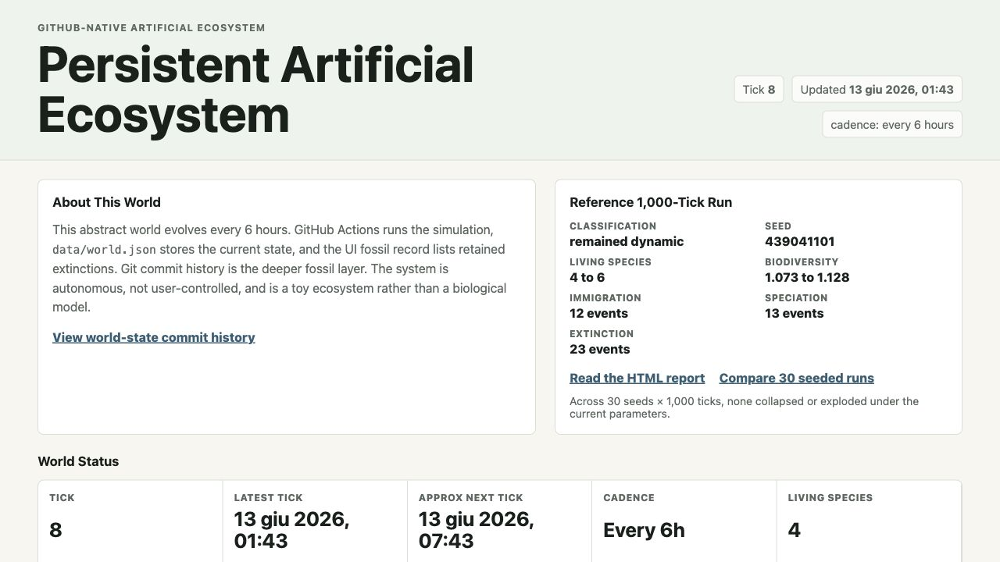

# Persistent Artificial Ecosystem

A tiny GitHub-native artificial ecosystem. The app is static, the world state is JSON, and GitHub Actions can evolve the simulation on a schedule by committing updated files back to the repository.



Live demo: <https://vale717171.github.io/persistent-artificial-ecosystem/>

## What It Is

This is a small artificial ecosystem that treats GitHub as the habitat. There is no backend server, database, queue, or hosted worker. The world lives in [`data/world.json`](data/world.json), GitHub Actions evolves that JSON on a schedule, and GitHub Pages displays the latest committed state.

The UI fossil record is based on retained extinction data. The deeper fossil layer is the [`data/world.json` commit history](https://github.com/Vale717171/persistent-artificial-ecosystem/commits/main/data/world.json): the repository history is the persistence model and the audit trail.

## Why GitHub?

GitHub is not just hosting for this project. It is the machinery of the world:

- **Actions are the clock:** scheduled workflow runs advance the simulation every six hours.
- **JSON is the world state:** `data/world.json` is the current map, species list, event log, and RNG state.
- **Commits are the fossil record:** each automated state update becomes a permanent historical layer in the [`data/world.json` history](https://github.com/Vale717171/persistent-artificial-ecosystem/commits/main/data/world.json).
- **Pages is the observatory:** the static web UI lets visitors inspect the latest committed world.

## Current Features

- Static web app deployable with GitHub Pages.
- No backend server or database.
- Persistent world state stored in [`data/world.json`](data/world.json).
- Local and GitHub Actions simulation runner.
- Grid map with biomes, food values, and per-cell details.
- Species with simple traits: preferred biome, size, speed, fertility, resilience, and metabolism.
- Reproduction, mutation, death, and extinction events.
- Browser UI for world status, map, species list, event timeline, fossil record, and population trends.
- Biodiversity index, living/extinct species counts, total population, and average food metrics.
- Cache-busted `data/world.json` loading so the Pages UI asks for fresh state on every page load.

## Local Setup

Run one simulation tick:

```bash
npm run simulate
```

Run seven ticks:

```bash
npm run simulate:week
```

Serve the static app locally:

```bash
npm run serve
```

You can also use any static file server. A server is recommended because browsers may block `fetch("data/world.json")` from local `file://` pages.

## Long-Term Analysis

Generate stability reports from an in-memory copy of the current world:

```bash
node scripts/long-run-report.js
```

By default this simulates 1,000 ticks and writes Markdown, HTML, and JSON outputs under `reports/long-run-1000.*` without modifying `data/world.json`.

You can pass a custom tick count and output path:

```bash
node scripts/long-run-report.js 2500 reports/long-run-2500.md
```

Run a multi-seed stability sweep:

```bash
node scripts/stability-summary.js
```

By default this tests 30 seeds × 1,000 ticks and writes `reports/stability-summary.json` and `reports/stability-summary.html`.

The current reference sweep should be read modestly: Across 30 seeds × 1,000 ticks, none collapsed or exploded under the current parameters. The `dynamic` label comes from the project's simple classification criteria, not from a proof of general ecological stability.

## GitHub Pages Deployment

1. Push this repository to GitHub.
2. Open the repository settings.
3. Go to **Pages**.
4. Select **Deploy from a branch**.
5. Choose the default branch and the repository root.
6. Save.

The app will load `data/world.json` directly from the published Pages site.

## Scheduled Evolution

The workflow at [`.github/workflows/evolve-world.yml`](.github/workflows/evolve-world.yml) runs every six hours and can also be started manually with **workflow_dispatch**.

Each run:

1. Checks out the repository.
2. Runs `node scripts/simulate.js`.
3. Commits the changed `data/world.json` file back to the branch.

This makes GitHub itself the persistence layer. The commit history becomes a durable timeline of ecosystem changes.

## Design Notes

- **Deterministic seed:** the simulation uses a tiny dependency-free `xorshift32` RNG. The current RNG state is stored in `data/world.json`, so each tick is reproducible from the committed state that produced it.
- **Fair species processing:** living species are shuffled with the seeded RNG before each tick, so earlier species in the JSON array do not always consume food first.
- **Births and deaths:** rates mean expected births or deaths per individual for a tick. The simulator uses probabilistic rounding instead of multiplying rates by an extra random factor, which makes outcomes easier to reason about while preserving variation.
- **Autonomous novelty:** rare immigration or speciation events can introduce new species without user input, comments, commands, LLM calls, or external services.
- **Limits:** this is still a small toy ecosystem. It has no spatial movement, no predator/prey model, no genetics beyond simple trait mutation, and no backend process beyond scheduled GitHub Actions.

## Reddit-Ready Short Explanation

I built a tiny artificial ecosystem that lives entirely inside a GitHub repo.

There is no backend. The world state is just `data/world.json`. A scheduled GitHub Action runs a small Node simulation, mutates the JSON, and commits it back to `main`. GitHub Pages then renders the latest committed state as a dashboard: grid map, biomes, food, species traits, population trends, event timeline, biodiversity, and a fossil record when species go extinct.

It is intentionally simple, but the fun part is the persistence model: GitHub history is the ecosystem's memory.

## Architecture

```text
.
├── index.html                  Static app shell
├── styles.css                  UI styling
├── app.js                      Reads JSON state and renders the UI
├── docs/
│   └── ecosystem-screenshot.jpg README screenshot
├── data/
│   └── world.json              Persistent world state
├── reports/
│   ├── long-run-1000.html      Reference long-run report
│   └── stability-summary.html  Multi-seed stability summary
├── scripts/
│   └── simulate.js             Node-based simulation tick runner
└── .github/workflows/
    └── evolve-world.yml        Scheduled world evolution
```

The simulation is intentionally simple:

- Food regrows by biome each tick.
- Species consume food from their preferred biome.
- Births are affected by fertility, food availability, and size.
- Deaths are affected by scarcity, metabolism, and resilience.
- Mutations occasionally nudge numeric traits up or down.
- Random events can reduce food, create blooms, or cause disease.
- Any species reaching zero population is recorded as extinct.

## Data Model

`data/world.json` contains:

- `tick`: current simulation tick.
- `updatedAt`: last evolution timestamp.
- `map`: grid dimensions and cells.
- `species`: living or extinct species and their traits.
- `events`: recent event log.
- `history`: population snapshots for trend rendering.
- `extinctions`: permanent extinction records.

## Future Roadmap

- Add species positions and movement between cells.
- Add predator/prey relationships and trophic levels.
- Add seeded randomness for reproducible simulation runs.
- Split world data into multiple JSON files once the ecosystem grows.
- Add visual overlays for population density and food pressure.
- Add branch-based experiments for alternate evolutionary histories.
- Add GitHub issue generation for major ecological events.
- Add import/export tools for user-created species and maps.
